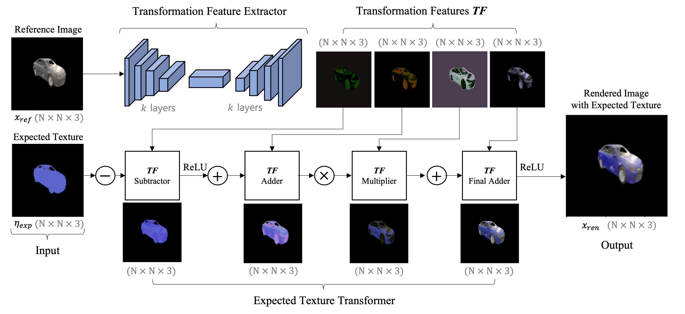
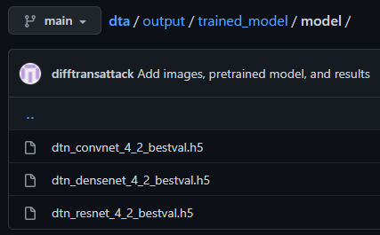
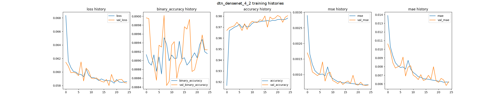
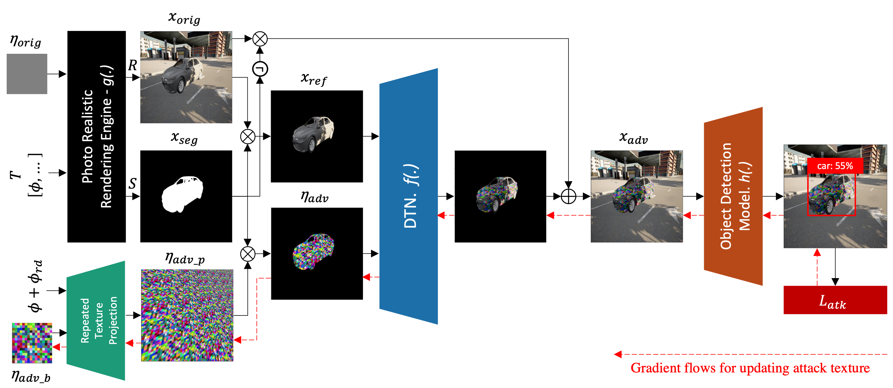
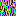
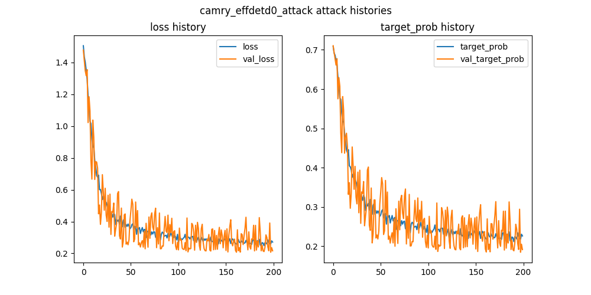
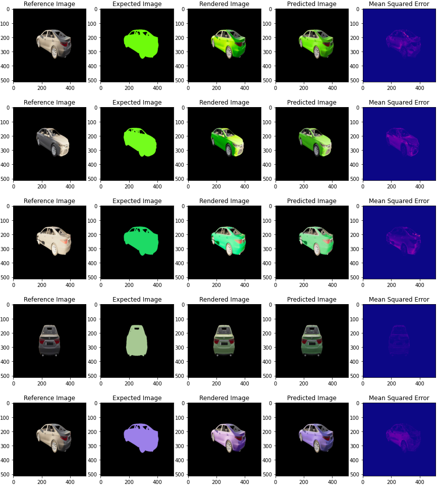
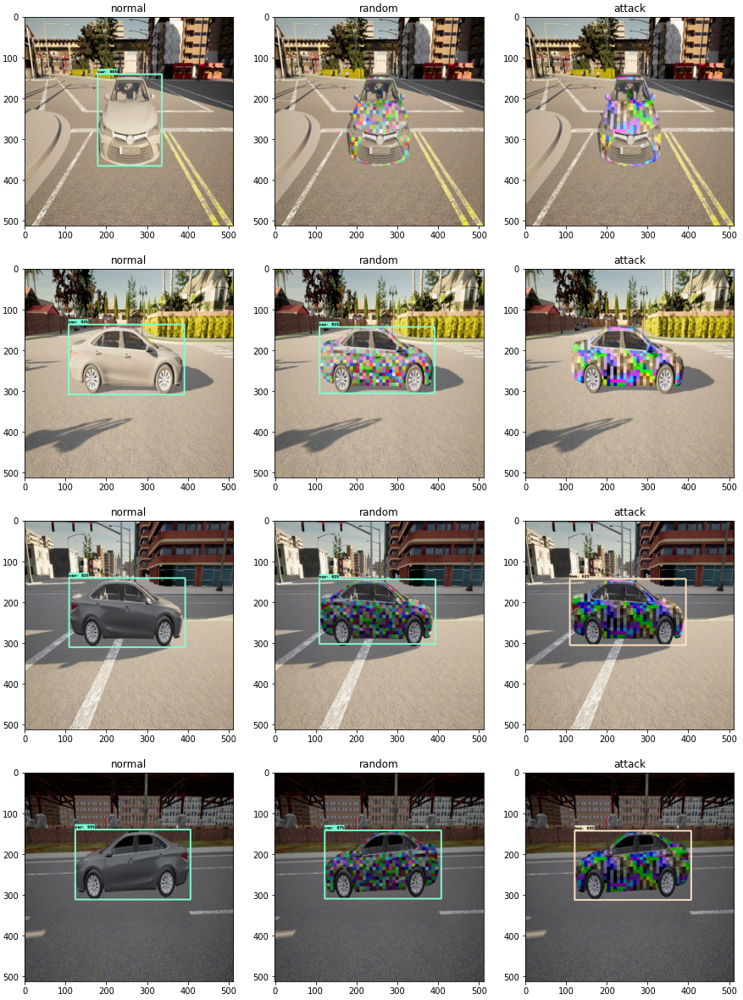

# DTA: Physical Camouflage Attacks using Differentiable Transformation Network [Supplementary Material]

## [Important Note for Reviewer]
Due to confidentiality reasons, unfortunately, we cannot disclose any part of our code publicly on GitHub. Instead, we can only show our results, output screenshots, and visualizations.

Nevertheless, we can still provide the code in the supplementary material, strictly for reviewing purpose. We kindly request the reviewers to examine the "code_supplementary" folder located in the zip file.

We are aware that in our abstract, we specifically mentioned that our source code, generated data, and pre-trained model are available in the GitHub. Unfortunately, it was after the paper's submission deadline that we received the information about our code should remain private.

We apologize for the inconvenience caused.

Photo-Realistic Simulation Demo |  Real World Demo
:-----------------------------:|:-----------------------------:
  |  

## Overview
**DTA: Physical Camouflage Attacks using Differentiable Transformation Network** is implemented using TensorFlow 2 except for photo-realistic render, in which we use [CARLA](https://carla.org/) simulator (version 0.9.11) on [Unreal Engine](https://www.unrealengine.com/en-US/) (version 4.24).

Detail prerequisites for the DTA framework are available at `README.md` inside "code_supplementary" folder.


## Dataset
We use [CARLA](https://carla.org/), an open-source autonomous driving simulator to synthesis our dataset.

The synthesized datasets contain flat color textures, segmentation images, and rendered images that are grouped by same transformation and texture as visualized bellow.

 

We provide 2 datasets (camry_train_50 and camry_test_50) for DTN model training and 1 dataset (camry_ref) for DTA attack pattern generation.
The download links are included in supplementary `README.md`


## Run the code

### 1. Train DTN Model
Before we can generate the attack pattern using our full DTA framework, you need to train DTN model to learn the transformation of target object when texture is changed.



The training code is available on the supplementary materials, whereas its detailed instruction can be found on `README.md`

The code will output the trained model in h5, evaluation plots, and sample images. Please open "output/trained_model" in this git for output samples.

Below are the examples for each output generated by our training code:

#### Trained Model


#### Evaluation plots


```
=== Training Data ===
loss: 0.05890905484557152; binary_accuracy: 0.8889914751052856; accuracy: 0.9793922901153564; mse: 0.0007434855797328055; mae: 0.006715591065585613; 

=== Validation Data ===
loss: 0.058879513293504715; binary_accuracy: 0.8890600204467773; accuracy: 0.9790117740631104; mse: 0.0007173483027145267; mae: 0.006581704597920179; 

=== Test Data ===
loss: 0.059596624225378036; binary_accuracy: 0.8889378905296326; accuracy: 0.9790832996368408; mse: 0.0007514968747273088; mae: 0.0066836136393249035; 
```

#### Sample Images
```
Please open ./output/trained_model/sample_imgs/
```


### 2. Generate the attack pattern using DTA Framework
After complete the DTN model training, you can start generate attack pattern using DTA framwork by running attack code.



The attack code is available on the supplementary materials, whereas its detailed instruction can be found on `README.md`

This code will output generated attack pattern and evaluation plots. Please open "output/generated_attack" in this git for looking at the output samples.

Below are the example for each output generated by our attack code:

#### Attack Pattern


#### Evaluation Plots


## Demo

Besides training and attack pattern generation code, we also provide a demo code in the Jupyter notebook located in the `demo` folder to demonstrate how our DTN model and full DTA Framework prediction look like.

It can be run after installing the prerequisites and downloading our generated dataset on the supplementary materials.

Below are the examples for each output generated by our training code:

#### DTN Prediction Sample


#### DTA Framework Prediction Sample

